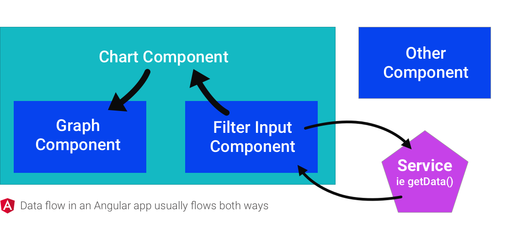
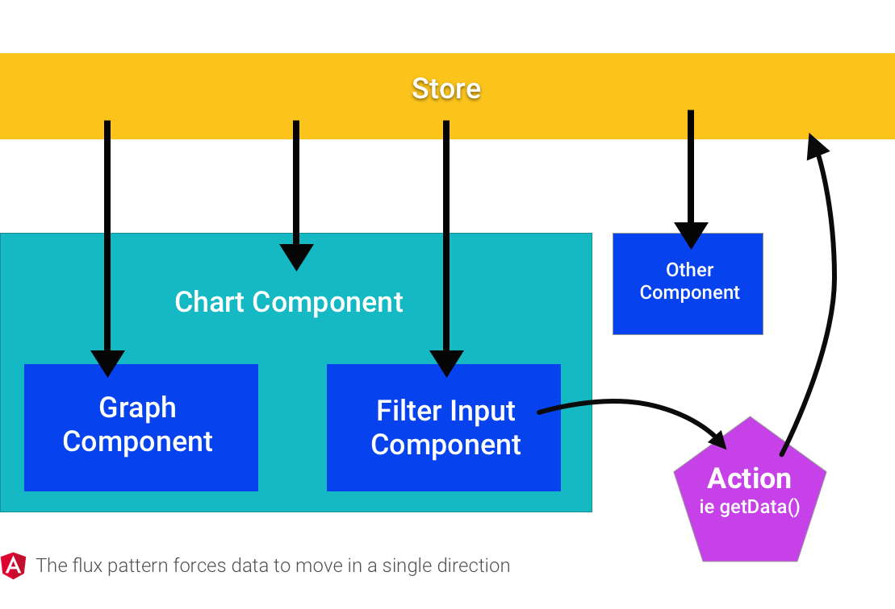
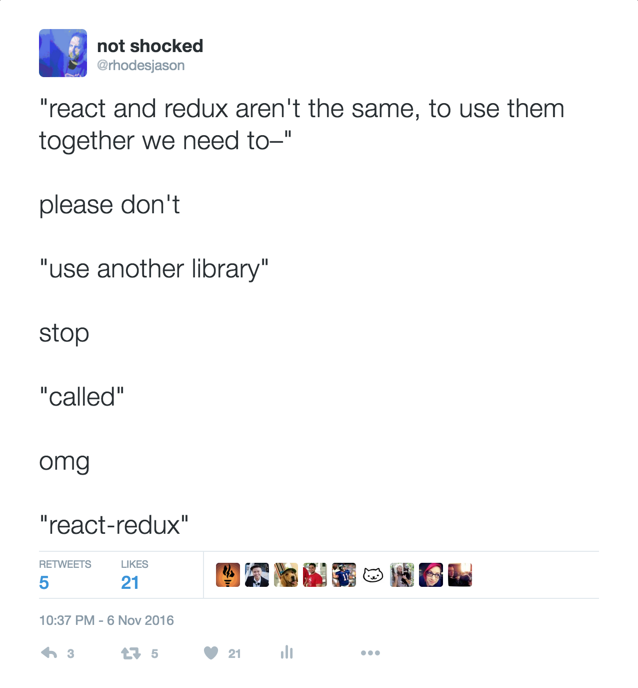

# how-to-react
Remembering how I finally made sense of react

It took me a long time to even start to grasp what react is and how it would really work for a serious application. I've just started to get my head around the edges of an app that pulls together React, Redux, redux-thunk, react-router, and some other things so I want to get those notes together in a mini-guide, if for no other reason than to walk myself through it all again when I'm confused in 6 weeks.


### How a JavaScript app works

Note: If you already understand Angular to some degree, you might prefer to skip to that section.

HTML works for a lot of things on the web, and if you're okay with making new requests to a server for any change, it'll do most anything. Say you have a totally useless page with a dumb banner on it.

```html
<body>
  <section>
    <h1>Default message for this banner</h1>
  </section>
  <footer>
    Brought to you by html
  </footer>
</body>
```

What HTML isn't so good at is changing things. If (for some reason) you wanted to let a user change the banner message here with just HTML, you'd probably create a new HTML page for each different banner, and then use anchor links to move between the individual pages. Or you could use JavaScript.

```html
<!-- add a button and some ids -->
<section>
  <h1 id='banner'>Default message for this banner</h1>
  <button id='changeMessage'>Update message</button>
</section>
```

```javascript
const banner = document.getElementById('banner')
const button = document.getElementById('changeMessage')

button.addEventListener('click', function(e) {
  banner.innerHTML = 'Some different message'
})
```


The reason we need JavaScript here is because we've introduced ✨ state ✨ to the page. State is a value or list of values that you want to keep track of. In this example we now want the banner to display "a message" value, and to have a user action that can update that value and display the change in the page. With this simple JS example, I'm storing the state in the HTML itself. This was also usually how jQuery kept track of state, too.

```javascript
const $ = jQuery
const messages = [
  'A totally different random message',
  'This message maybe came from an async API call',
  'Wow this is another message'
];

$(document).ready(function () {
  const banner = $("#banner")
  $('#changeMessage').on('click', function() {
    const oldMessage = banner.text()
    banner.text(messages.shift())
    messages.push(oldMessage)
  })
})
```

In both of these examples so far, the "current message" is just whatever's in the HTML at a given time. There's no reason to worry about keeping the state in sync with the HTML--they're already in sync by default. For a lot of reasons that become clear as you build a bigger and bigger app, this kind of state management became unwieldy, so JavaScript frameworks emerged to help out.

### How Angular works, kind of

JS frameworks attempt to provide some ways to store your state, as well as your methods to change that state, in an organized way. If you're familiar with BackboneJS, it organized these things using models, collections, and views. With Angular, you have "components" (formerly directives), which are not much more than some config that ties together an HTML template and a controller class.

The banner template:
```html
<div>
  <h1>{{ banner.message }}</h1>
  <button>Update message</button>
</div>
```

The banner component:
```javascript
import template from '../templates/banner.html'

class BannerCtrl {
  constructor() {
    this.message = 'Some default message'
  }
}

export default angular.module('bannerComponent', [])
  .component('banner', {
    template,
    controller: BannerCtrl,
    controllerAs: 'banner'
  })
```

Notice how the values aren't stored in the HTML anymore, but on the controller instance here (e.g. `this.message`). The template (view) refers to that value using `{{ }}` braces, and Angular makes sure that the HTML is auto-updated any time that value changes. To make those changes, I'd provide a method on the controller class and reference it in the template, like this:

```javascript
import template from '../templates/banner.html'

const messages = [
  'Default message for the banner',
  'A totally different random message',
  'This message maybe came from an async API call',
  'Wow this is another message'
]

class BannerCtrl {
  constructor() {
    this.message = 'Some default message'
  }

  updateMessage() {
    const message = messages.shift()
    messages.push(this.message)
    this.message = message
  }
}

export default angular.module('bannerComponent', [])
  .component('banner', {
    template,
    controller: BannerCtrl,
    controllerAs: 'banner'
  })
```

And then reference the new controller method from the template:
```html
<div>
  <h1>{{ banner.message }}</h1>
  <button ng-click="banner.updateMessage()">Update message</button>
</div>
```

This uses angular's `ng-click` attribute to tap into the click event, during which I reference the controller as `banner` and call the new `updateMessage` method which rotates through the messages. Because the template is bound to a value stored in our state, when that controller value gets updated, Angular updates the HTML.

This works, but it's a good idea to move the message handling logic out of the controller (better organization, reuse, etc). Here's a simple message service:

```javascript
const messages = [
  'Default message for the banner',
  'A totally different random message',
  'This message maybe came from an async API call',
  'Wow this is another message'
]

export default class {

  get() {
    const msg = messages.shift()
    messages.push(msg)
    return msg
  }

}
```

Now the component can import the message service, depend on it in the angular module and then use it in the component controller's `updateMessage` method:

```javascript
import angular from 'angular'
import template from '../templates/banner.html'
import messageService from '../services/messages'

class BannerCtrl {
  constructor(messages) {
    this.message = ''
    this.buttonText = 'Update message'
    this.messages = messages
    this.updateMessage()
  }

  updateMessage() {
    this.message = this.messages.get()
  }
}

export default angular.module('bannerComponent', [messageService.name])
  .component('banner', {
    template,
    controller: BannerCtrl,
    controllerAs: 'banner'
  })

```

Take a look at [the Angular example code](angular) to see how this all works together.

### How React is kind of like Angular (\*ducks\*)

A React app also starts with a component. Like Angular, it's basically a "template" and a "controller", but it's all contained in one class. The "template" part is represented here by the JSX returned in the class's `render` method (👋 Backbone), while the "controller" is basically the rest of the class.

If JSX freaks you out, read [Facebook's explanation](https://facebook.github.io/react/docs/jsx-in-depth.html).

Here's the example banner component from before, as a React class component:
```javascript
import React, { Component } from 'react'

export default class Banner extends Component {

  constructor(props) {
    super(props)
    this.state = {
      message: 'Default message'
    }
  }

  render() {
    return (
      <div>
        <h1>{this.state.message}</h1>
        <button>Update message</button>
      </div>
    )
  }

}
```

This component reads from `this.state.message` and makes changes to that message using `this.setState({ message: 'new message' })`. Whenever the state is updated, the render method is called to re-render the "view". To complete the example from before, we can add an updateMessage method and move the message handling out to some service.

The service might look like this:
```js
const messages = [
  'Default message for the banner',
  'A totally different random message',
  'This message maybe came from an async API call',
  'Wow this is another message'
]

export default {
  get() {
    const message = messages.shift()
    messages.push(message)
    return message
  }
}
```
_\*fwiw React doesn't have any "official" services like Angular, but encapsulating this kind of thing would still be a good idea, whatever you called it._

And the refactored component:
```javascript
import React, { Component } from 'react'
import messages from '../services/messages'

export default class Banner extends Component {
  constructor() {
    super()
    this.state = {
      message: 'The original message',
      buttonText: 'Update message'
    }
  }

  updateMessage() {
    this.setState({ message: messages.get() })
  }

  render() {
    return (
      <div className='banner'>
        <h1>{this.state.message}</h1>
        <button onClick={() => this.updateMessage()}>{this.state.buttonText}</button>
      </div>
    )
  }
}
```

And that's the banner example implemented in React. Take a look at [the complete React example](react) to see more.

### Why Flux?

To put it simply, Flux is "unidirectional data flow". It's not a library, but it's a pattern that a lot of Flux-happy libraries have adopted that works particularly well with React because of how fast React is at rendering, but you can use the Flux pattern with any framework.

Say you have a "chart component" on a page, that consists of subcomponents for the graph itself and a filter input to change the data displayed in the graph. In Angular, the data flow might look something like this:



When a user types in the filter input, this might happen:

1. The filter component calls a method on the service to get more data
1. The service makes a request, then gets the result
1. The service passes the result back to the filter
1. The filter has to send that new information up to the parent chart
1. The chart alerts the graph to update its data

If some "other component" that's also on the page would like access to this newly filtered data, you'll need to have the filter somehow pass it, or the chart could emit an event that the other component could listen on, etc. Since data is flowing in all different directions between all different pieces, things can get out of hand.

Compare this to the Flux pattern, in general:



Now the flow is:

1. The filter calls a method called an "action creator" which will get more data
1. The action creator makes a request, then gets the result
1. The action creator returns an "action", with a `type` and a `payload` (which is the new data)
1. The action is sent to the store
1. The store is connected to all components, and depending on the type of action, components are re-rendered with new data

Now data flows in a single direction, and while the pub-sub pattern is still happening somewhat, the "sub" side is in one place and much easier to reason about. Also, if any component wants to listen to an action type, it can, without any code changes.

### Redux, a form of Flux

Look at the React component from our previous example, adapted to work in a "flux way", using a flux library called Redux.

```js
import React, { Component } from 'react'
import { updateMessage } from '../actions'

export default class Banner extends Component {
  render() {
    return (
      <div>
        <h1>{this.props.message}</h1>
        <button onClick={updateMessage}>Update message</button>
      </div>
    )
  }
}
```

The first thing you might notice is that there's no constructor and no local state. You can have local state even while using Redux, but in our example we won't have any. Instead, we'll get all of our values from the Redux store, which will be connected to `this.props` in our component. This component isn't connected to the Redux store yet so we'll have to come back and connect it, but let's first look at the `updateMessage` action creator:

```js
const messages = [
  'A totally different random message',
  'This message maybe came from an async API call',
  'Wow this is another message',
  'Default message for the banner'
]

export function updateMessage() {
  const message = messages.shift()
  messages.push(message)

  return {
    type: 'UPDATE_MESSAGE',
    payload: message
  }
}
```

It looks a lot like the service in the earlier example, except that it returns _an action_ instead of the new value by itself. By flux convention, the value is stored as `payload` and a `type` is set. The action is sent to the store, which then needs to know how to process the action and send the new data to registered components. In Redux, this is done in part using functions called "reducers". The main reducers file that represents the entire store might look like this in our example:

```js
import { combineReducers } from 'redux'
import BannerReducer from './banner'

const reducers = {
  banner: BannerReducer
}

export default combineReducers(reducers)
```

This means that the store, which is one big object, has a key called `banner` whose value is controlled by the `BannerReducer`. You can have as many keys controlled by reducers as you want here. Those reducers look like this:

```js
const defaultBanner = {
  message: 'Default message for the banner',
  buttonText: 'Update message'
}

export default (state = defaultBanner, action) => {
  switch (action.type) {
    case 'UPDATE_MESSAGE':
      return {
        ...state,
        message: action.payload
      }

    default:
      return state
  }
}
```

The function defined here is given the current `state` (but only the value it's responsible for, so the `banner` key in this case) and the action that was created. Then for each expected `action.type`, the reducer returns the appropriate state. Sometimes it might pull something out of the payload or rearrange it, sometimes it might just set it to a new key. And by default, it returns the state unaltered.

The last step is to go back to our component and connect it to the store. To do that, we need to use a function cleverly called `connect`, provided by a library called `react-redux`.



```js
import React, { Component } from 'react'
import { connect } from 'react-redux'

import { updateMessage } from '../actions'

class Banner extends Component {
  render() {
    return (
      <div className='banner'>
        <h1>{this.props.message}</h1>
        <button onClick={this.props.updateMessage}>Update message</button>
      </div>
    )
  }
}

const mapStateToProps = (state) => state.banner
const bindActionCreators = () => {
  return { updateMessage }
}

export default connect(mapStateToProps, bindActionCreators)(Banner)
```

The connection here is happening in four steps:

1. Define a function called `mapStateToProps` that will receive the entire global state and return just the parts we care about.
1. Define a function called `bindActionCreators` that will return an object hash of the action creator methods we want to use
1. Call the `connect` function with `mapStateToProps` and `bindActionCreators` as args -- it will return another function
1. Call the function returned from `connect`, passing it the component

Once that's done, the component works! Clicking the button calls the action creator, and since we connected it to the Redux store, Redux will receive the action and pass it to _all_ the reducers, who will look at the type and either modify their own part of the state tree or let it just pass through. Any reducer who cares about the `UPDATE_MESSAGE` action will assign the new values to the `banner` key, which will cause any components connected to that part of the state to re-render.

PHEW.
