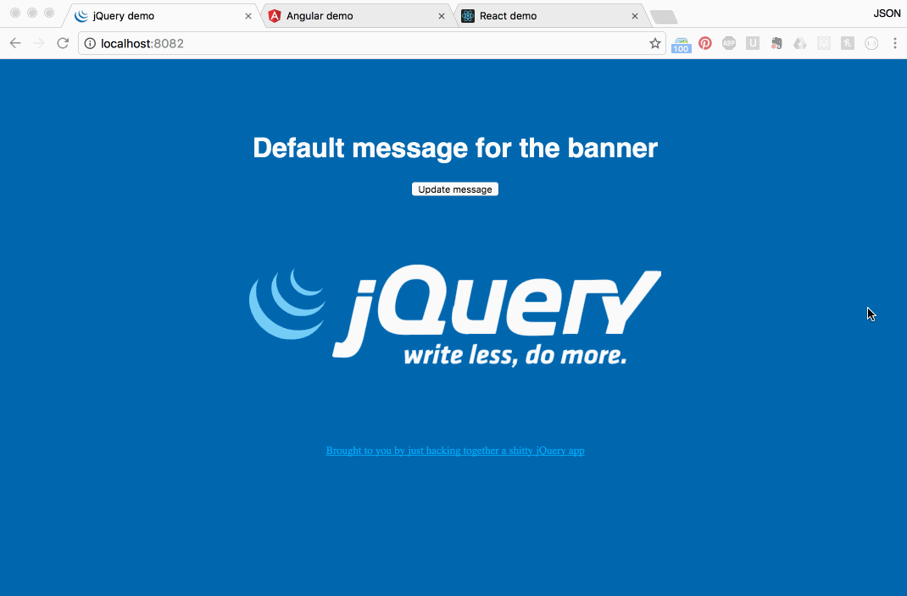

# how-to-react
Remembering how I finally made sense of react

It took me a long time to even start to grasp what react is and how it would really work for a serious application. I've just started to get my head around the edges of an app that pulls together React, Redux, redux-thunk, react-router, and some other things so I want to get those notes together in a mini-guide, if for no other reason than to walk myself through it all again when I'm confused in 6 weeks.

More to come...
