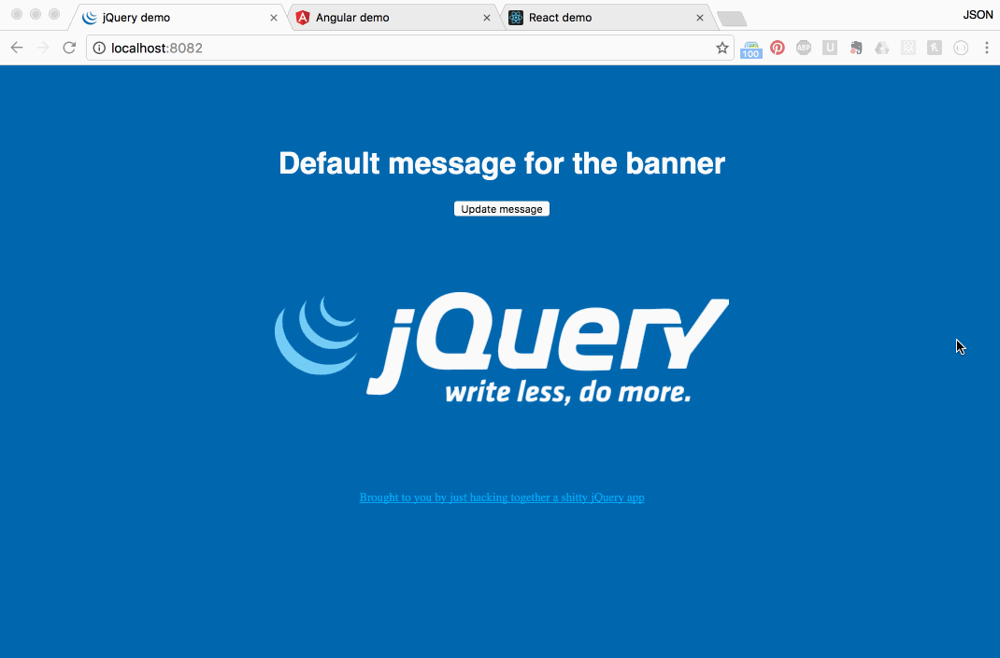
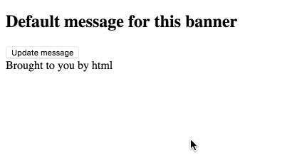

# how-to-react
Remembering how I finally made sense of react

It took me a long time to even start to grasp what react is and how it would really work for a serious application. I've just started to get my head around the edges of an app that pulls together React, Redux, redux-thunk, react-router, and some other things so I want to get those notes together in a mini-guide, if for no other reason than to walk myself through it all again when I'm confused in 6 weeks.



### How a JavaScript app works

Note: If you already understand Angular to some degree, you might prefer to skip to that section.

HTML works for a lot of things on the web, and if you're okay with making new requests to a server for any change, it'll do most anything. Say you have a totally useless page with a dumb banner on it.

```html
<body>
  <section>
    <h1>Default message for this banner</h1>
  </section>
  <footer>
    Brought to you by html
  </footer>
</body>
```

What HTML isn't so good at is changing things. If (for some reason) you wanted to let a user change the banner message here with just HTML, you'd probably create a new HTML page for each different banner, and then use anchor links to move between the individual pages. Or you could use JavaScript.

```html
<!-- add a button and some ids -->
<section>
  <h1 id='banner'>Default message for this banner</h1>
  <button id='changeMessage'>Update message</button>
</section>
```

```javascript
const banner = document.getElementById('banner')
const button = document.getElementById('changeMessage')

button.addEventListener('click', function(e) {
  banner.innerHTML = 'Some different message'
})
```



The reason we need JavaScript here is because we've introduced ✨ state ✨ to the page. State is a value or list of values that you want to keep track of. In this example we now want the banner to display "a message" value, and to have a user action that can update that value and display the change in the page. With this simple JS example, I'm storing the state in the HTML itself. This was also usually how jQuery kept track of state, too.

```javascript
const $ = jQuery
const messages = [
  'A totally different random message',
  'This message maybe came from an async API call',
  'Wow this is another message'
];

$(document).ready(function () {
  const banner = $("#banner")
  $('#changeMessage').on('click', function() {
    const oldMessage = banner.text()
    banner.text(messages.shift())
    messages.push(oldMessage)
  })
})
```

In both of these examples so far, the "current message" is just whatever's in the HTML at a given time. There's no reason to worry about keeping the state in sync with the HTML--they're already in sync by default. For a lot of reasons that become clear as you build a bigger and bigger app, this kind of state management became unwieldy, so JavaScript frameworks emerged to help out.

### How Angular works, kind of

JS frameworks attempt to provide some ways to store your state, as well as your methods to change that state, in an organized way. If you're familiar with BackboneJS, it organized these things using models, collections, and views. With Angular, you have "components" (formerly directives), which are not much more than some config that ties together an HTML template and a controller class.

The banner template:
```html
<div>
  <h1>{{ banner.message }}</h1>
  <button>Update message</button>
</div>
```

The banner component:
```javascript
import template from '../templates/banner.html'

class BannerCtrl {
  constructor() {
    this.message = 'Some default message'
  }
}

export default angular.module('bannerComponent', [])
  .component('banner', {
    template,
    controller: BannerCtrl,
    controllerAs: 'banner'
  })
```

Notice how the values aren't stored in the HTML anymore, but on the controller instance here (e.g. `this.message`). The template (view) refers to that value using `{{ }}` braces, and Angular makes sure that the HTML is auto-updated any time that value changes. To make those changes, I'd provide a method on the controller class and reference it in the template, like this:

```javascript
import template from '../templates/banner.html'

const messages = [
  'Default message for the banner',
  'A totally different random message',
  'This message maybe came from an async API call',
  'Wow this is another message'
]

class BannerCtrl {
  constructor() {
    this.message = 'Some default message'
  }

  updateMessage() {
    const message = messages.shift()
    messages.push(this.message)
    this.message = message
  }
}

export default angular.module('bannerComponent', [])
  .component('banner', {
    template,
    controller: BannerCtrl,
    controllerAs: 'banner'
  })
```

And then reference the new controller method from the template:
```html
<div>
  <h1>{{ banner.message }}</h1>
  <button ng-click="banner.updateMessage()">Update message</button>
</div>
```

This uses angular's `ng-click` attribute to tap into the click event, during which I reference the controller as `banner` and call the new `updateMessage` method which rotates through the messages. Because the template is bound to a value stored in our state, when that controller value gets updated, Angular updates the HTML.

This works, but it's a good idea to move the message handling logic out of the controller (better organization, reuse, etc). Here's a simple message service:

```javascript
const messages = [
  'Default message for the banner',
  'A totally different random message',
  'This message maybe came from an async API call',
  'Wow this is another message'
]

export default class {

  get() {
    const msg = messages.shift()
    messages.push(msg)
    return msg
  }

}
```

Now the component can import the message service, depend on it in the angular module and then use it in the component controller's `updateMessage` method:

```javascript
import angular from 'angular'
import template from '../templates/banner.html'
import messageService from '../services/messages'

class BannerCtrl {
  constructor(messages) {
    this.message = ''
    this.buttonText = 'Update message'
    this.messages = messages
    this.updateMessage()
  }

  updateMessage() {
    this.message = this.messages.get()
  }
}

export default angular.module('bannerComponent', [messageService.name])
  .component('banner', {
    template,
    controller: BannerCtrl,
    controllerAs: 'banner'
  })

```

Take a look at [the Angular example code](angular) to see how this all works together.

### How React is kind of like Angular (\*ducks\*)

A React app also starts with a component. Like Angular, it's basically a "template" and a "controller", but it's all contained in one class. The "template" part is represented here by the JSX returned in the class's `render` method (👋 Backbone), while the "controller" is basically the rest of the class.

If JSX freaks you out, read [Facebook's explanation](https://facebook.github.io/react/docs/jsx-in-depth.html).

Here's the example banner component from before, as a React class component:
```javascript
import React, { Component } from 'react'

export default class Banner extends Component {

  constructor(props) {
    super(props)
    this.state = {
      message: 'Default message'
    }
  }

  render() {
    return (
      <div>
        <h1>{this.state.message}</h1>
        <button>Update message</button>
      </div>
    )
  }

}
```

This component reads from `this.state.message` and makes changes to that message using `this.setState({ message: 'new message' })`. Whenever the state is updated, the render method is called to re-render the "view". To complete the example from before, we can add an updateMessage method and move the message handling out to some service.

The service might look like this:
```js
const messages = [
  'Default message for the banner',
  'A totally different random message',
  'This message maybe came from an async API call',
  'Wow this is another message'
]

export default {
  get() {
    const message = messages.shift()
    messages.push(message)
    return message
  }
}
```
_\*fwiw React doesn't have any "official" services like Angular, but encapsulating this kind of thing would still be a good idea, whatever you called it._

And the refactored component:
```javascript
import React, { Component } from 'react'
import messages from '../services/messages'

export default class Banner extends Component {
  constructor() {
    super()
    this.state = {
      message: 'The original message',
      buttonText: 'Update message'
    }
  }

  updateMessage() {
    this.setState({ message: messages.get() })
  }

  render() {
    return (
      <div className='banner'>
        <h1>{this.state.message}</h1>
        <button onClick={() => this.updateMessage()}>{this.state.buttonText}</button>
      </div>
    )
  }
}
```

And that's the banner example implemented in React. Take a look at [the complete React example](react) to see more.

### Uggggggggh what's flux what's redux why

Facebook [describes flux](https://facebook.github.io/flux/) like this:

> It complements React's composable view components by utilizing a unidirectional data flow. It's more of a pattern rather than a formal framework, and you can start using Flux immediately without a lot of new code.

That description never helped me, to be honest. "More of a pattern" made it hard to practically sink my teeth into it. It really wasn't until I started playing with a _flavor_ or implementation of flux, called [Redux](http://redux.js.org/), that it finally started to click. "Unidirectional data flow" is pretty nice, it turns out.

Look at the React component from our previous example, adapted to work in a "flux way", using Redux.

```javascript
import React, { Component } from 'react'
import { updateMessage } from '../actions'

class Banner extends Component {
  constructor() {
    this.state = {
      message: 'Default message for the banner'
    }
  }
  render() {
    return (
      <div>
        <h1>{this.state.message}</h1>
        <button onClick={updateMessage}>Update message</button>
      </div>
    )
  }
}

export default Banner
```

Disclaimer: I know this wouldn't work yet, but let's move slowly. Notice how the on click listener here (`updateMessage`) doesn't do anything with its result. It doesn't wait for the new message and set it somewhere, it just says "update the message please, thank you". In flux, that's called "creating an action". And update message should look pretty familiar, too:

```javascript
const messages = [
  'A totally different random message',
  'This message maybe came from an async API call',
  'Wow this is another message',
  'Default message for the banner'
]

export function updateMessage() {
  const message = messages.shift()
  messages.push(message)

  return {
    type: 'UPDATE_MESSAGE',
    payload: message
  }
}
```

The big difference here is what this method _returns_. That object with a `type` and a `payload` is called an action, and is a flux convention. `updateMessage` is an "action creator" because calling it creates or returns an action. But that action isn't returned to the component, so where does it go? In redux, it go


```javascript
import React, { Component } from 'react'
import { connect } from 'react-redux'

import { updateMessage } from '../actions'

class Banner extends Component {
  render() {
    return (
      <div>
        <h1>{this.props.message}</h1>
        <button onClick={this.props.updateMessage}>Update message</button>
      </div>
    )
  }
}

function mapStateToProps(state) {
  return { message: state.message }
}

function bindActionCreators() {
  return { updateMessage }
}

export default connect(mapStateToProps, bindActionCreators)(Banner)
```

Two new functions here in the component: `mapStateToProps` (for reading state) and `bindActionCreators` (for updating state). The `connect` method allows the component to be connected to the single store where all of the redux state values are kept. This component only cares about `state.message`, so we "map" our state to our component and only give it the `state.message` value. Now we can reference `this.props.message` in our component JSX.

To update state, we need to bring in an action creator and connect it to our component so that redux knows about it. The `bindActionCreators` function just returns a hash of methods that should be registered with redux (will talk about that more in a second) and made available on the component's `this.props` as well.

So with these two funcdtions and the `connect` utility, this component is connected to the global redux state. When `this.props.updateMessage` is called in the onClick listener, the action creator returns this action:

```javascript
{
  type: 'UPDATE_MESSAGE',
  payload: message // some new message
}
```

Every single action created (so long as the action creator was registered with redux using the `connect` utility) is passed to a list of functions, kind of like event listeners, known as "reducers". This is the redux-specific part of the lesson. This app might have a message reducer that could look like this:

```javascript
export default (state = 'Default message for the banner', action) => {
  switch (action.type) {
    case 'UPDATE_MESSAGE':
      return action.payload

    default:
      return state
  }
}
```

This function would be called for _every_ action ever created by the app, so the `switch` statement specified which action types this reducer cares about. This lets reducers "listen" to any actions they want to listen to, which allows components to share access to any part of the global state, whenever they want.

We set up all of our reducers like this:

```javascript
import { combineReducers } from 'redux'
import MessageReducer from './message'

const reducers = {
  message: MessageReducer
}

export default combineReducers(reducers)
```

The `reducers` constant here is the global state object. `message` is a top-level key whose value is managed by the Message reducer, which by default returns "Default message for the banner", using JS default values. Any time an action of type 'UPDATE_MESSAGE' is called, the reducer expects the `payload` key to be the new message, and returns that value which replaces the old. Any components that are connected to that state value would be re-rendered.

### Buh guh
