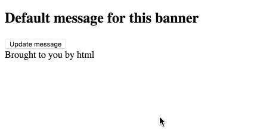

## Managing state with plain JavaScript and jQuery

HTML works for a lot of things on the web, and if you're okay with making new requests to a server for any change, it'll do most anything. Say you have a totally useless page with a dumb banner on it.

```html
<body>
  <section>
    <h1>Default message for this banner</h1>
  </section>
  <footer>
    Brought to you by html
  </footer>
</body>
```

What HTML isn't so good at is changing things. If (for some reason) you wanted to let a user change the banner message here with just HTML, you'd probably create a new HTML page for each different banner, and then use anchor links to move between the individual pages. Or you could use JavaScript.

```html
<!-- add a button and some ids -->
<section>
  <h1 id='banner'>Default message for this banner</h1>
  <button id='changeMessage'>Update message</button>
</section>
```

```javascript
const banner = document.getElementById('banner')
const button = document.getElementById('changeMessage')

button.addEventListener('click', function(e) {
  banner.innerHTML = 'Some different message'
})
```



The reason we need JavaScript here is because we've introduced ✨ state ✨ to the page. State is a value or list of values that you want to keep track of. In this example we now want the banner to display "a message" value, and to have a user action that can update that value and display the change in the page. With this simple JS example, I'm storing the state in the HTML itself. This was also usually how jQuery kept track of state, too.

```javascript
const $ = jQuery
const messages = [
  'A totally different random message',
  'This message maybe came from an async API call',
  'Wow this is another message'
];

$(document).ready(function () {
  const banner = $("#banner")
  $('#changeMessage').on('click', function() {
    const oldMessage = banner.text()
    banner.text(messages.shift())
    messages.push(oldMessage)
  })
})
```

In both of these examples so far, the "current message" is just whatever's in the HTML at a given time. There's no reason to worry about keeping the state in sync with the HTML--they're already in sync by default. For a lot of reasons that become clear as you build a bigger and bigger app, this kind of state management became unwieldy, so JavaScript frameworks emerged to help out.

See more of [the plain JS example code](../plain-js).  
See more of [the jQuery example code](../jquery).

Next: [Managing state with Angular](angular.md)
