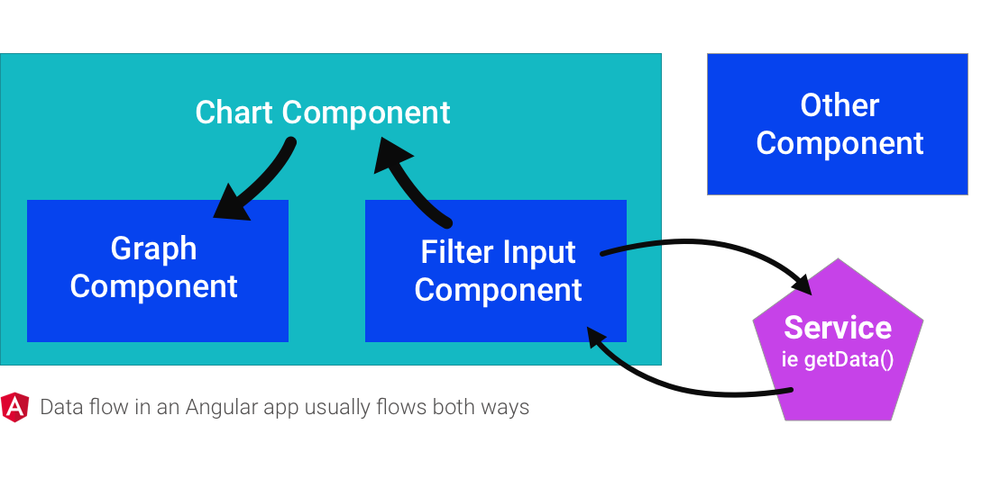
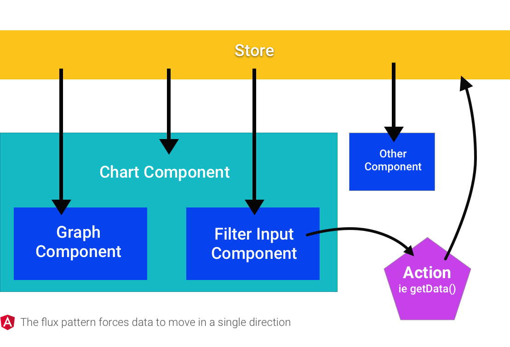
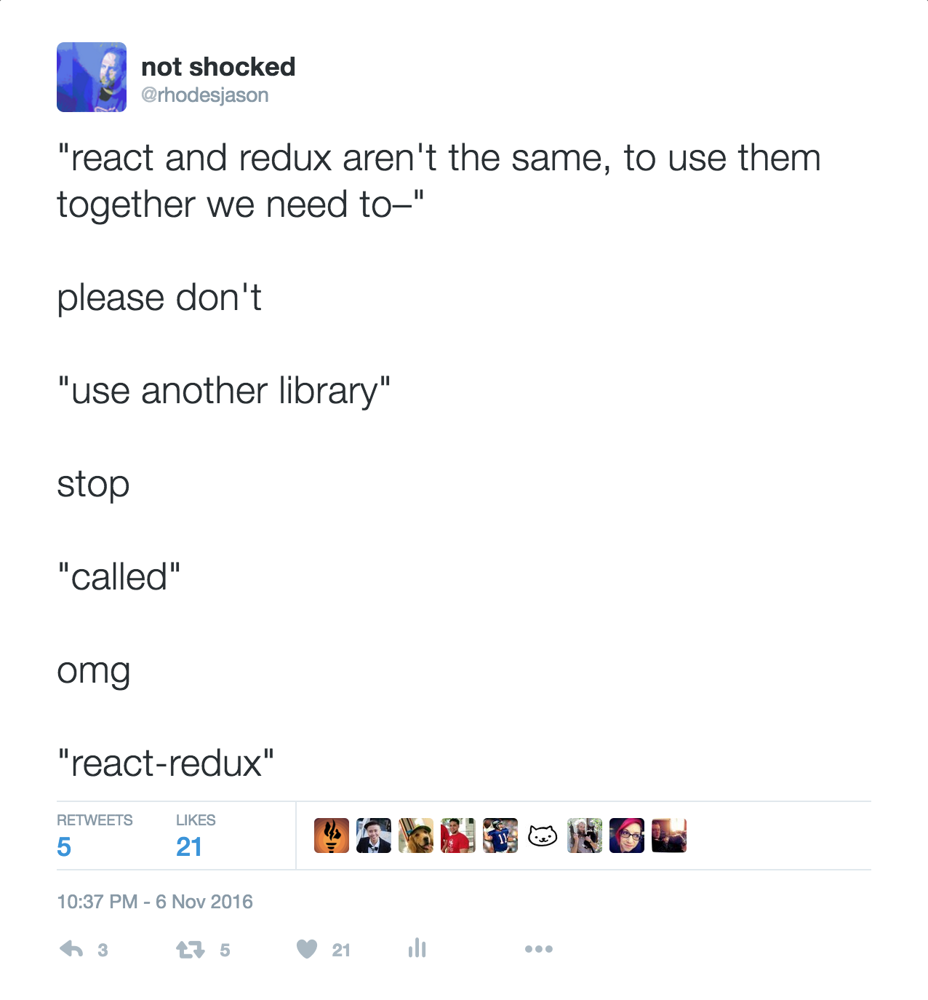

## Flux and Redux

### Why Flux?

To put it simply, Flux is "unidirectional data flow". It's not a library, but it's a pattern that a lot of Flux-happy libraries have adopted that works particularly well with React because of how fast React is at rendering, but you can use the Flux pattern with any framework.

Say you have a "chart component" on a page, that consists of subcomponents for the graph itself and a filter input to change the data displayed in the graph. In Angular, the data flow might look something like this:



When a user types in the filter input, this might happen:

1. The filter component calls a method on the service to get more data
1. The service makes a request, then gets the result
1. The service passes the result back to the filter
1. The filter has to send that new information up to the parent chart
1. The chart alerts the graph to update its data

If some "other component" that's also on the page would like access to this newly filtered data, you'll need to have the filter somehow pass it, or the chart could emit an event that the other component could listen on, etc. Since data is flowing in all different directions between all different pieces, things can get out of hand.

Compare this to the Flux pattern, in general:



Now the flow is:

1. The filter calls a method called an "action creator" which will get more data
1. The action creator makes a request, then gets the result
1. The action creator returns an "action", with a `type` and a `payload` (which is the new data)
1. The action is sent to the store
1. The store is connected to all components, and depending on the type of action, components are re-rendered with new data

Now data flows in a single direction, and while the pub-sub pattern is still happening somewhat, the "sub" side is in one place and much easier to reason about. Also, if any component wants to listen to an action type, it can, without any code changes.

### Redux, a form of Flux

Look at the React component from our previous example, adapted to work in a "flux way", using a flux library called Redux.

```js
import React, { Component } from 'react'
import { updateMessage } from '../actions'

export default class Banner extends Component {
  render() {
    return (
      <div>
        <h1>{this.props.message}</h1>
        <button onClick={updateMessage}>Update message</button>
      </div>
    )
  }
}
```

The first thing you might notice is that there's no constructor and no local state. You can have local state even while using Redux, but in our example we won't have any. Instead, we'll get all of our values from the Redux store, which will be connected to `this.props` in our component. This component isn't connected to the Redux store yet so we'll have to come back and connect it, but let's first look at the `updateMessage` action creator:

```js
const messages = [
  'A totally different random message',
  'This message maybe came from an async API call',
  'Wow this is another message',
  'Default message for the banner'
]

export function updateMessage() {
  const message = messages.shift()
  messages.push(message)

  return {
    type: 'UPDATE_MESSAGE',
    payload: message
  }
}
```

It looks a lot like the service in the earlier example, except that it returns _an action_ instead of the new value by itself. By flux convention, the value is stored as `payload` and a `type` is set. The action is sent to the store, which then needs to know how to process the action and send the new data to registered components. In Redux, this is done in part using functions called "reducers". The main reducers file that represents the entire store might look like this in our example:

```js
import { combineReducers } from 'redux'
import BannerReducer from './banner'

const reducers = {
  banner: BannerReducer
}

export default combineReducers(reducers)
```

This means that the store, which is one big object, has a key called `banner` whose value is controlled by the `BannerReducer`. You can have as many keys controlled by reducers as you want here. Those reducers look like this:

```js
const defaultBanner = {
  message: 'Default message for the banner',
  buttonText: 'Update message'
}

export default (state = defaultBanner, action) => {
  switch (action.type) {
    case 'UPDATE_MESSAGE':
      return {
        ...state,
        message: action.payload
      }

    default:
      return state
  }
}
```

The function defined here is given the current `state` (but only the value it's responsible for, so the `banner` key in this case) and the action that was created. Then for each expected `action.type`, the reducer returns the appropriate state. Sometimes it might pull something out of the payload or rearrange it, sometimes it might just set it to a new key. And by default, it returns the state unaltered.

The last step is to go back to our component and connect it to the store. To do that, we need to use a function cleverly called `connect`, provided by a library called `react-redux`.



```js
import React, { Component } from 'react'
import { connect } from 'react-redux'

import { updateMessage } from '../actions'

class Banner extends Component {
  render() {
    return (
      <div className='banner'>
        <h1>{this.props.message}</h1>
        <button onClick={this.props.updateMessage}>Update message</button>
      </div>
    )
  }
}

const mapStateToProps = (state) => state.banner
const bindActionCreators = () => {
  return { updateMessage }
}

export default connect(mapStateToProps, bindActionCreators)(Banner)
```

The connection here is happening in four steps:

1. Define a function called `mapStateToProps` that will receive the entire global state and return just the parts we care about.
1. Define a function called `bindActionCreators` that will return an object hash of the action creator methods we want to use
1. Call the `connect` function with `mapStateToProps` and `bindActionCreators` as args -- it will return another function
1. Call the function returned from `connect`, passing it the component

Once that's done, the component works! Clicking the button calls the action creator, and since we connected it to the Redux store, Redux will receive the action and pass it to _all_ the reducers, who will look at the type and either modify their own part of the state tree or let it just pass through. Any reducer who cares about the `UPDATE_MESSAGE` action will assign the new values to the `banner` key, which will cause any components connected to that part of the state to re-render.

PHEW.

Take a look at [the complete Redux example code](../react-redux).
